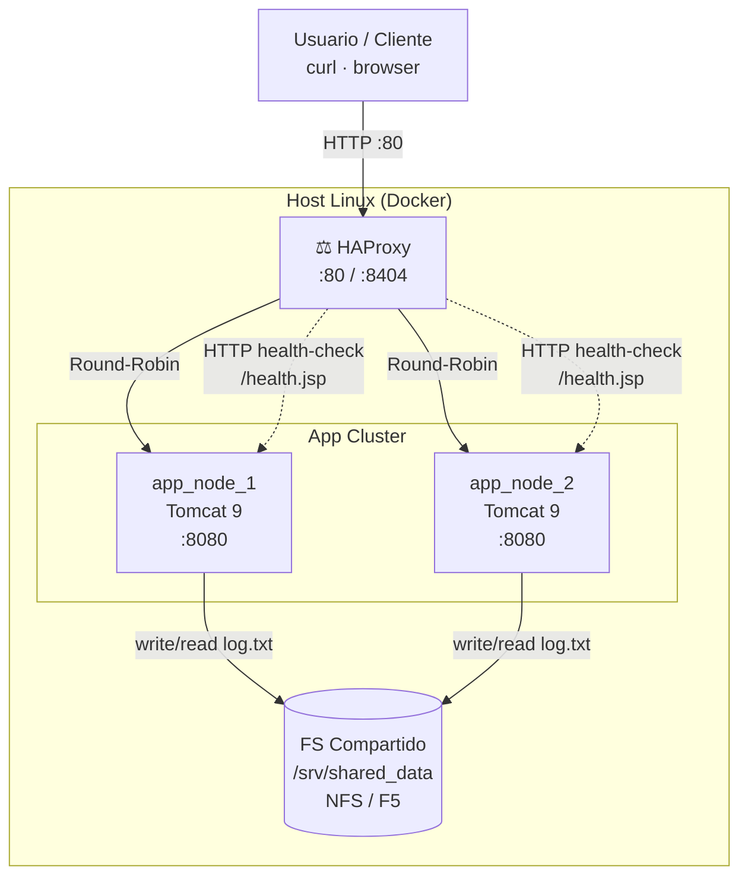

# Home-Lab de Infraestructura Virtualizada: Balanceo, Contenedores y Almacenamiento Compartido


## Arquitectura

Se emplea una máquina virtual con Debian 13. Se trata de una distribución estable, ligera y segura, con gran facilidad de escalamiento

## Stack Tecnológico
  - **Hypervisor:** VMware Workstation 25H2
  - **OS:** Debian 13 (Trixie)
  - **Orquestación:** Docker Engine,Docker Compose
        - Networking automático (bridge)
  - **Docker bridge network (lab_default)**
        - DNS interno de Docker
          - Resolución por nombre:
            - app_node_1
            - app_node_2
          - Port mapping:
            - 80 → HAProxy
            - 8404 → HAProxy stats
  - **Load Balancer:** HAProxy (alpine)
        - Layer 7 (HTTP)
        - Algoritmo: roundrobin
        - Health-checks HTTP
        - Failover automático
        - Panel de estadísticas (/stats)
  - **Aplicación JSP (Java Server Pages)**
      - Identificación del nodo activo
      - Obtención de IP / hostname
      - Lógica embebida (Java)
      - Manejo de excepciones
  - **Capa de aplicación**
      - **Apache Tomcat 9**
          - JDK: Temurin JDK 11
          - Despliegue vía webapps/ROOT
          - Compilación JSP (Jasper)
  - **Storage:** NFS compartido entre nodos
    - **Filesystem compartido**
      - Path host: /srv/shared_data
      - Path contenedor: /usr/local/tomcat/webapps/shared
    - Escritura concurrente
    - Persistencia entre nodos
    - Simulación de:
      - NFS
      - F5 shared storage
  - **Monitoreo**
      - HAProxy stats UI
      - Logs:
          - HAProxy access / health
          - Tomcat JSP errors
          - Archivo compartido log.txt


## Despliegue

```bash
  $ git clone https://github.com/Sebastian294/homelab-infra.git
  $ cd homelab-infra
  $ ./scripts/setup.sh
  $ docker-compose up -d 
```
## Esquema


